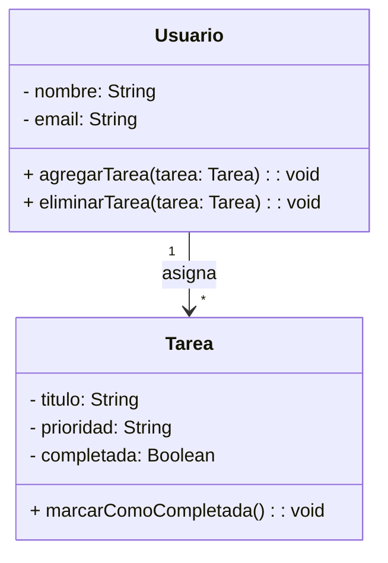

# TaskMaster - Aplicación de Gestión de Tareas

## Descripción

TaskMaster es una aplicación diseñada para mejorar la productividad, permitiendo gestionar tareas de manera eficiente. Con esta herramienta, los usuarios pueden organizar sus activadades diarias de manera sencilla y eficaz.

## Características

- :white_check_mark:Creación y edición de tareas
- :calendar:Asignación de fechas límite y prioridades.
  - Prioridad baja, media y alta.
  - Fechas límite personalizadas con control de calendario.
- :file_folder:Organización en categorías y etiquetas.
- :white_check_mark:Marcar tareas como completadas.
- :bell:Notificaciones y recordatorios automáticos.
- :clipboard:Visualización en lista y tablero Kanban.

## Instalación

Para instalar y ejecutar la aplicación, sigue los siguientes pasos:

\# Clonar el repositorio
git clone https://github.com/usuario/taskmaster.git  
cd taskmaster

\# Instalar dependencias
npm install

\# Ejecutar la aplicación
npm start

## Uso de la API

TaskMaster proporciona una API REST para gestionar tareas. A continuación, un ejemplo de cómo crear una tarea usando JavaScript:

```javascript
fetch('https://api.taskmaster.com/tasks', {
  method: 'POST',
  headers: {
    'Content-Type': 'application/json'
  },
  body: JSON.stringify({
    title: 'Comprar leche',
    description: 'Comprar leche en el supermercado',
    priority: 'alta',
    dueDate: '2024-07-01'
  })
})

```

## Fórmula de Productividad

La eficiendia del usuario es calcula con la siguiente fórmula: 

$$E = \frac{\text{Tareas Completadas}}{\text{Tareas Totales}} \times 100$$

Donde:

+ E es la eficiencia en porcentaje.
+ Tareas Completadas es el número de tareas finalizadas por el ususario.
+ Tareas Totales es el número total de tareas asignadas.

## Diagrama de Clases

La siguiente representación en UML muestra la estructura del sistema:



## Capturas de Pantalla

A continuación, una vista previa de la interfaz de usuario:


Para registar una nueva tarea, sigue estos pasos:

1. Haz clic en el botón **Nueva Tarea**.
2. Completa el formulario con los datos de la tarea.
  i. **Título**: Nombre de la tarea.
  ii. **Prioridad**: Nivel de importancia (baja, media alta).
  iii. **Fecha Límite**: Día y hora de vencimiento.
1. Haz clic en **Guardar** para agregar la tarea a tu lista.
2. ¡Listo! La tarea se ha registrado correctamente.
   
Si deseas que el título de la tarea sea visible en negrita, escríbelo entre dobles asteristos: \**Título de la Tarea\**.

## Historial de versiones

En la siguiente tabla se muestran las versione publicadas de la aplicación:

| Versión | Fecha | Descripción |
| ---: | :---: | :--- |
| 1.0.0 | 01/01/2024 | Lanzamiento inicial  |
| 1.1.0 | 15/01/2024 | Nuevas funcionalidades |
| 1.1.1 | 30/01/2024 | Corrección de errores |
| 1.2.0 | 15/02/2024 | Mejoras de rendimiento |
| 2.0.0 | 15/03/2024 | Versión estable |
| 2.1.0 | 30/03/2024 | Corrección de errores |
| 2.2.0 | 15/04/2024 | Mejoras de usabilidad |
| 2.3.0 | 30/04/2024 | Nuevas funcionalidades |

## Créditos

Desarrollado por Hanouni Otero Karim. Para más información, visita el repositorio en GitHub: 

[Repositorio de la Tarea 6.1](https://github.com/KarimBlackStar/CD_6.1.git)

## Licencia 

Este proyrecto está bajo la Licencia MIT.
